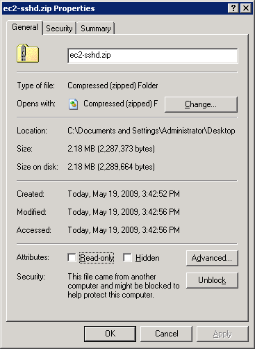

# What is this?

Windows AMIs on Amazon EC2 do not have a readily usable remote access technology (unlike their Unix counterparts),
and this makes it unnecessarily hard to utilize Windows instances programmatically
(such as from [Jenkins](http://jenkins-ci.org/).)

So this project develops a SSH daemon for EC2, which is capable of:

* Transfering files in both directions (via SCP)
* Launching processes on Windows (part of SSH)
* Authenticating inbound connections by using the key used to launch the instance.

While this daemon speaks the SSH protocol, this is not a real SSH daemon. Specifically,
it doesn't authenticate the user against as a Windows user, nor does it launch a new process
under a different user account (it always runs programs in the same user that runs the ec2-sshd itself.)

# Installation

* [Install a JRE](http://java.com/) on your Windows AMI
* Download `ec2-sshd-*-bin.zip` from [Maven repository](http://search.maven.org/#search%7Cgav%7C1%7Cg%3A%22org.jvnet.ec2-sshd%22%20AND%20a%3A%22ec2-sshd%22)
and extract it somewhere. Because of the tightened security setting on EC2 Windows AMIs, attempt to extract
this zip file will fail, unless you open the property dialog of the file and click "Unblock".
See the screenshot below for how to do this.
* Place the extracted files somewhere, like `C:\ec2-sshd`, and from command prompt, execute
`C:\ec2-sshd\ec2-sshd.exe install`. This will install the Windows service to be started automatically
when Windows boot.
* If you prefer, you can also run `C:\ec2-sshd\ec2-sshd.exe start` to start it immediately. You can test the behaviour before you bundle the image.

At this point, you can bundle your Windows AMI, and if you start the new AMI that you bundle, sshd
service will be running upon the boot.



# Usage

* This daemon will listen on port 22. Make sure your security group setting allows inbound connections to this port.
* Use an ssh client to connect. The daemon is indifferent to the user name, but it only accepts public key authentication,
and you need to use the same private key that you used for launching AMI. This is how it authenticates you.
* The daemon implements SCP on its own, so you can use that to send/receive files. For example, try this:
```
scp -i ~/my-ec2-privatekey /some/local/file $EC2HOST:c:/test.txt
```
* The daemon can fork and execute processes. For example, try this:
```
ssh -i ~/my-ec2-privatekey $EC2HOST java -fullversion
```
* If you run ssh without specifying any command, it starts `cmd.exe`, but don't expect this to really work,
because there's no terminal support.
